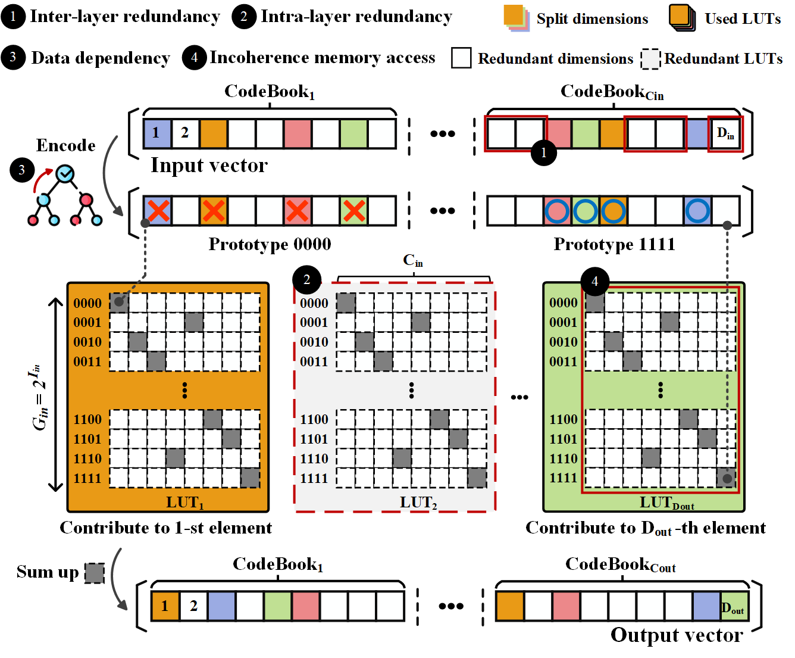
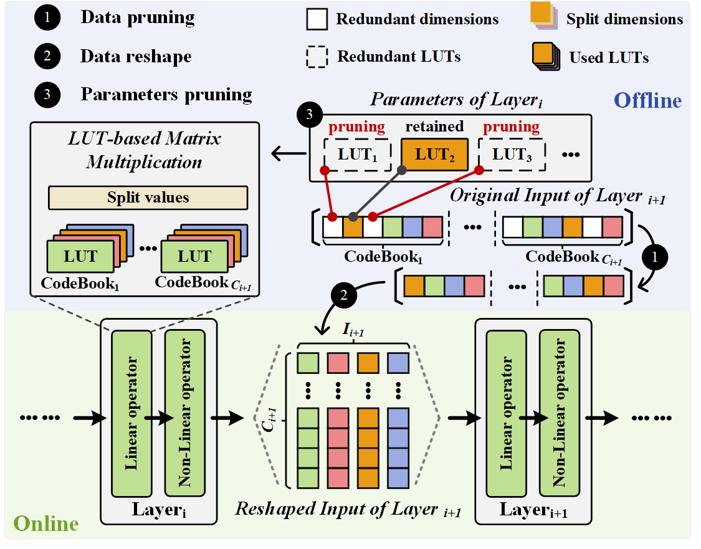

# LUT-MU based NN acceleration on FPGA

This is repository shows **training** and **deployment** example of using LUT-MU based NN models proposed in the paper *Mitigating scalability challenges in LUT-based neural networks via pruning optimisations* accepted by IEEE Transaction on Computers 2026

## Abstract
Modern deep neural networks heavily rely on a large number of multiply-accumulate operations, which constitute the predominant computational cost. To address this, Look-Up Table (LUT)-based matrix multiplications have emerged as a promising alternative for reducing the computational cost and time of the multiply-accumulate operations in a neural network. However, the LUT-based neural network still faces the scalability challenge due to the inherent limitations of LUT-based matrix multiplication. To mitigate these scalability limitations, this paper proposes a scalable and energy-efficient LUT-based approximate matrix multiplication unit (LUT-MU) constituting the basic component of the neural networks by integrating a pruning strategy on the MADDNESS algorithm, a LUT-based matrix multiplication methodology. With increasing problem size and precision demands in matrix multiplication, our proposed LUT-MU architecture effectively constrains resource expansion. The case study shows that deploying our LUT-MU in neural network architectures, including fully connected layers (MNIST) and ResNets (CIFAR-10, ImageNet)—on XCZU7EV and XCZU19EG FPGAs, produces up to $1.6 \times$ throughput improvement and $4.2 \times$ energy efficiency gains over mainstream CUDA-based network implementations, and $1.8\times$ energy efficiency compared to leading quantised neural network implementations, with moderate impact on accuracy. Compared to original MADDNESS-based neural networks, our LUT-MU shows $1.3$ to $2.6\times$ resource savings based on various resolution configuration settings of MADDNESS.

## Main ideas: Pruning & LUT Partition

 - The index-based clustering mechanism of Product Quantisation (e.g., [MADDNESS](https://github.com/dblalock/bolt)) can **restrict dot-product computations in successive layers to selected indices**, offering a natural opportunity for computational pruning in neural networks. 
 - The codebook-independent memory access partten allows LUT-MU **colum-wisely partion LUT into distributed ROMs**, which alleviates the throughput bottleneck derived from incoherence memory access.

## Implementation

The implementation of LUT-MU is based on [Halutmatmul](https://github.com/joennlae/halutmatmul.git), [Brevitas](https://github.com/Xilinx/brevitas) and [FINN](https://github.com/Xilinx/finn) workflow:
-  **Halutmatmul** enables the training of LUT-MU based NN by using differentiable operator.
 - **Brevitas** is the front-end of FINN, which supports Quantised Awared Training (QAT).
 - **FINN** provides End-to-End deployment (convert **Brevitas** qonnx to bitstream).

## Quick start

- Follow the [manual](./train) to train LUT-MU based NN.

- Follow the [manual](./deploy) to generate and deploy bitstream on FPGA. (🚧 **TODO** 🚧)

## Reference
- [Stella Nera: Achieving 161 TOp/s/W with Multiplier-free DNN Acceleration based on Approximate Matrix Multiplication](https://arxiv.org/pdf/2311.10207) (i.e., [Halutmatmul](https://github.com/joennlae/halutmatmul))
- [Multiplying Matrices Without Multiplying](https://arxiv.org/pdf/2106.10860) (i.e., [MADDNESS](https://github.com/dblalock/bolt))
- Xilinx - [brevitas](https://github.com/Xilinx/brevitas)
- Xilinx - [FINN](https://github.com/Xilinx/finn)