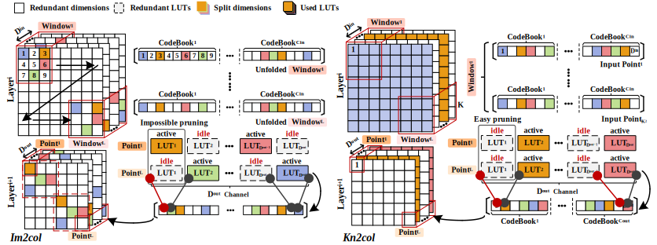

## Redundancies LUTs pruning


Most NN models are constructed by cascading repeated computation blocks, and the operations in each block consist of linear operators (e.g., matrix multiplication, reshape) and nonlinear operators (e.g. batch normalisation, activation). We notice that all split dimensions in input vectors of matrix multiplication are **predetermined** during the offline training stage. These properties expose us to an opportunity to eliminate inter-layer redundancies. 

However, naviely applying window-independent clustering to Im2col-transformed matrix results in some LUTs sitting idle during a single inference, and makes  it difficult to prune these LUTs. To prune redundancies LUT of MADDNESS, we conduct unified clustering on all **points** of kn2col-transformed matrix, allowing them to share the same split dimentsion across channels.

## Train LUT-MU based NN

The training scripts are build on [Halutmatmul](https://github.com/joennlae/halutmatmul). The LUT-MU based convolution `LUTMUConv2d` is defined in [modules.py](halutmatmul/modules.py#1319) and its LUT generation is implemented in [learn.py](halutmatmul/learn.py#103). To track the changes from Halutmatmul, we preserved historical patches. Please see [here](patches) for more edition details.

### 1. Environment setup

Run following command in the directory `LUT-MU/train` to set up conda environment accordingly. 
```bash
# pytorch-cuda=11.7 and cupy_cuda11x
conda env create -f environment_cuda11.yml
# pytorch-cuda=12.1 and cupy_cuda12x
conda env create -f environment_cuda12.yml
```
### 2. LUT-MU Configuration

- Modify the configuration (e.g., `resnet18_layers` and `resnet9_layers`) in [analysis_helper.py](utils/analysis_helper.py) to specify the target layers where LUT-MU should be substituted.

- Edit [json configuration](configs) to customise codebook length $C$ and number of prototypes $K$ for each layer. The $i$-th `length_per_codebook` and `prototype_per_codebook` will be applied to $i$-th layer of `resnet18_layers` or `resnet9_layers` defined in [analysis_helper.py](utils/analysis_helper.py)

### 3. Custom model

Please see `QuantResNet9` in [qatresnet9.py](models/qatresnet9.py) or `QuantResNet` in [qatresnet.py](models/qatresnet.py) and [examples](https://github.com/Xilinx/brevitas/tree/master/src/brevitas_examples) to learn how to customise models using **Breviates** operators and LUT-MU.

### 4. Command Line Interface Example

1. Run `train.py` as [train_example.sh](train_example.sh) to generate quantised weights for the original model using standard quantised matrix multiplication.
2. Run `retraining.py` as [retrain_example.sh](retrain_example.sh) to layer-wisely replace quantised matrix multiplication into Halutmatmul or LUT-MU and fine-tune its LUT. 
   - run `retraining.py` without `--kn2col`, `--lutmu` and `--kc_config` for im2col Halutmatmul
   - run `retraining.py` with `--kn2col` for kn2col Halutmatmul
   - run `retraining.py` with `--kn2col`, `--lutmu` and `--kc_config` for LUT-MU
3. The model checkpoints are saved in `model_checkpoints/output/halut/testname/checkpoints`. The `retraining.py` saves fine-tuned model weights with the best accuracy as `model_best-XX.YY.pth`. For example, replacing 7 layers to LUT-MU will generate 7 `model_best-XX.YY.pth` files. Use [check_pth.py](check_pth.py) to identify the desired model checkpoints.

## Directory Structure

```text
train
  │ # model defination
  ├─models
  │   ├─ ...
  │   ├─qatresnet.py
  │   └─qatresnet9.py
  │   
  │ # LUT-MU layer configuration
  ├─configs
  │   ├─quant_resnet9_num_C_8_K_16.json
  │   ├─quant_resnet18_num_C_8_K_16.json
  │   └─quant_resnet50_custom_C_K.json
  │
  │ # Core implementation
  ├─halutmatmul
  │   ├─ ...
  │   ├─learn.py
  │   ├─modules.py
  │   └─halutmatmul.py
  │
  │ # Historical changes from halutmatmul
  ├─patches
  │
  │ # Model checkpoints
  ├─model_checkpoints
  │   ├─ ...
  │   │ # The output dir name given in train_example.sh
  │   └─output
  │       │ # Original Model with quantised matrix multiplication
  │       ├─checkpoint.pth 
  │       │ # The model checkpoint with the best accuracy
  │       ├─model_best-XX.YY.pth
  │       └─halut
  │           ├─ ...
  │           │ # The testname given in retrain_example.sh
  │           └─testname
  │                 │ # Store model checkpoint with the best accuracy
  │                 ├─checkpoints
  │                 │ # Store updated LUTs of targets layers
  │                 ├─learned
  │                 │ # Sampled input vector to XXX layer for later clustering.
  │                 └─XXX.npy 
  │
  │ # Evaluation accuracy reports of non-trained (directly use LUT) 
  │ # and trained (use fine-tuned LUT) models in 'model_checkpoints/output/testname'
  └─results
        └─ data
            ├─ ...
            │ # The output dir name given in train_example.sh
            └─output
                ├─ ...
                │ # The testname given in retrain_example.sh
                └─testname
                    ├─ retrained_X_trained.json
                    └─ retrained_X.json
   
```